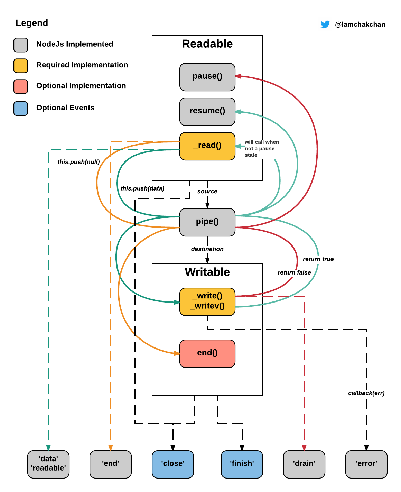

# NodeStream

Nodejs流，可对大文件按块处理，避免对内存的大量消耗。

## 类型

* ReadableStream：可读流，数据生产者
* WritableStream：可写流，数据消费者
* DuplexStream：双向流，即可读也可写
* TransformStream：转化流，数据的转化者

## 可读流

### 常用事件

可监听流事件data与end，data代表流动的数据块，end代表数据流流动结束。
```javascript
readableStream.on('data',function(){});
readableStream.on('end',function(){});
```
### 常用方法

* Readable.pause() 这个方法会暂停流的流动。换句话说就是它不会触发data事件。
* Readable.resume() 这个方法与上面的方法功能相反。它是恢复流的流动。
* Readable.unpipe() 这个方法会把目的地移除。如果有参数传入，他会让可读流停止流向某个特定的目的地，否则，它会移除所有目的地。

**开发中，可用https://github.com/node-modules/stream-wormhole来模拟消耗可读流。**

## 可写流

### 重要事件

* error：写入或链接发生错误时触发
* pipe：可读流链接到可写流时触发
* unpipe：在可读流调用unpipe时触发

### 注意

WritableStream在调用end方法后，所有数据会被写入，然后流会触发一个finish事件。注意在调用end()之后，你就不能再往可写流中写入数据了。

```javascript
readableStream.on('data',function(chunk){
  writableStream.write(chunk);
})
writableStream.end();
```

## Pipe

Pipe管道，当建立管道时，才会发生了流的流动。多个管道顺序调用，既是构建了链接（Chaining）。

```javascript
source
source.pipe(target)
```

当写入流处于繁忙状态时，write函数会返回false，pipe函数会自动启动背压机制。此机制会暂停可读流，直至可写流可写入数据。


