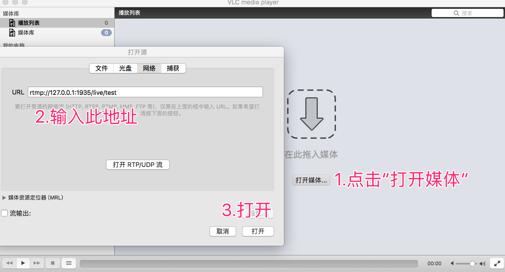

# 记一次OBS直播流程体验
OBS([Open Broadcaster Software](https://obsproject.com/))，一个开源的直播软件，可以把媒体数据以推流的形式发送到指定服务器。

## 推流服务器
常用协议RTMP，HLS。RTMP实时性较好(最小2s延迟)，HLS兼容性好，移动端设备友好，但延迟大。协议详细内容可以搜索一下。

我们选择Nginx --with-rtmp-module 作为推流服务器。

推荐使用Docker安装（Docker应该是现代开发者必备环境与技能）。

### 方式1：Docker启动
```bash
docker run -p 1935:1935 tiangolo/nginx-rtmp
```

### 方式2：本机安装（MacOS）
```bash
brew tap denji/nginx
brew install nginx-full --with-rtmp-module
```

使用下面的内容替换*/usr/local/etc/nginx/nginx.conf*
```json
worker_processes 1;
rtmp_auto_push on;
events {}
rtmp {
    server {
        listen 1935;

        application live {
            live on;
            record off;
        }
    }
}
```

nginx操作
```bash
nginx 启动
nginx -s reload 重加载配置
nginx -s quit 退出
```


## OBS设置流程


## 推流查看
OBS推流至媒体服务器，此时我们可以在你需要的端获取推流了。

### 方式1：VLC播放器
VLC（[下载](https://www.videolan.org/)）播放器支持各大终端方便快捷。


### 方式2：Web使用video.js

需要注意的是，video.js使用flash player播放RTMP推流，所以需要Chrome给授权（点击地址栏协议头处左侧图标，选择**网站设置**即可配置flash为**允许**）。

源代码:

```html
<!DOCTYPE html>
<html>
<head>
  <meta charset="UTF-8">
  <title>使用video.js直播RTMP推流</title>
  <!--引入样式-->
  <link href="http://vjs.zencdn.net/5.19/video-js.min.css" rel="stylesheet">
  <!--引入js-->
  <script src="http://vjs.zencdn.net/5.19/video.min.js"></script>
  <script src="https://cdn.jsdelivr.net/npm/videojs-flash@2/dist/videojs-flash.min.js"></script>
  <style>
    #player {
      margin: 0 auto;
    }
  </style>
</head>
<body>
<video id="player" class="video-js vjs-default-skin vjs-big-play-centered" 
       controls 
       preload="auto"
       autoplay="autoplay"
       data-setup='{}'>
  <!--type='rtmp/flv'-->
  <source src='rtmp://127.0.0.1:1935/live/test' type='rtmp/flv'/>
</video>

<script type="text/javascript">
  document.getElementById('player').setAttribute('height', document.documentElement.clientHeight);
  var player = videojs('player');
  player.play(); //播放
</script>
</body>
</html>
```

## 注意
* Chrome默认是禁用flash的所以需要修改网站设置。
* MacOS防火墙会导致局域网其他机器无法访问你的推流服务，可自行搜索Nginx Mac防火墙。

## 推荐自学关键词
* WebRTC
* TCP/UDP
* RTMP、RTSP
* EasyDarwin